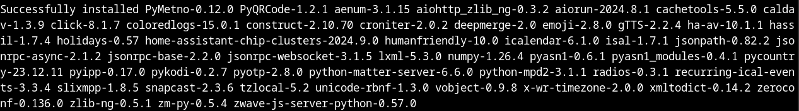

# HASS Core Installer

## About 

HASS Core Installer is a simple tool used to install, upgrade, and uninstall Home Assistant Core using a 
Python virtual environment on Linux. It can also be installed on Arm-64 bit devices such as the 
Raspberry Pi 5.
  
I created it to suppliment the [Official methods](https://www.home-assistant.io/installation/) of installing Home Assistant which are mainly aimed at beginners and non-advanced Linux users. Yet, while those methods offer an easy and quick way to install HASS and get going, they do not offer the flexibility, especially when it comes to 
upgrading to the new and latest versions of Home Assistant.

HASS Core Installer is mainly used by our company i.e. Jambula Labs to quickly install and upgrade Home Assistant to the latest  releases on Linux.  This includes our custom Linux operating system i.e. [Jambula OS Linux](https://github.com/zikusooka/jambula-OS/) 

HASS Core Installer also supports offline installs, upgrades, and uninstalls of Home Assistant Core.  Please note that in order for 
this to work, you must have pre-downloaded all the required python package dependencies and saved them in the 
python/archives directory

In case you don't know what it is, Home Assistant is an open-source home automation platform that focuses on 
privacy and local control. It is designed to be the central hub for managing and automating your smart home 
devices. Home Assistant integrates with a wide range of devices and services, allowing you to control your 
home environment from a single interface. It offers powerful automation features, notifications, and voice 
control, all while keeping your data private and secure.  You can read more about Home Assistant at:
https://home-assistant.io/


## Dependencies

1. Python version 3.12+
   Check your version using the command: ```python3 -V```

2. python3-dev, python3-pip, ensurepip, libturbojpeg

   On Debian/Ubuntu: ```apt install python3.12-venv python3-dev python3-pip libturbojpeg```

   On Fedora/RedHat: ```dnf install python3-virtualenv python3-devel python3-pip turbojpeg-devel```





## Installation

NOTE:  If you are using Jambula OS, you do not need to use this tool as it is already integrated with the OS images
       Simply run the setup tool which has an option to install Home Assistant Core

Open a terminal and navigate to the directory where this tool was cloned to. 
Execute the following command to start the installation process:
<b>IMPORTANT:  Make sure you are connected to the Internet </b>

    ```sudo ./INSTALL.sh```

Then wait a few minutes for install program to complete!


## Upgrade

Open a terminal and navigate to the directory where this tool was cloned to. 
Execute the following command to start the upgrade process:
<b>IMPORTANT:  Make sure you are connected to the Internet </b>


    ```sudo ./INSTALL.sh [NEW-VERSION] [OLD-VERSION]```
    Example:
    ```sudo ./INSTALL.sh  2024.1.4  2024.12.0```

Then wait a few minutes for upgrade program to complete!


## Configure Home Assistant ##

After installation or upgrade, you may need to configure Home Assistant to connect with your devices and set up automations. 
Refer to the [official documentation](https://www.home-assistant.io/docs/) for detailed setup and configuration instructions.
<b>HINT: Look in the scripts directory for some of our helper setup tools</b>


## Getting Started with Home Assistant

Once installed, you can access the Home Assistant web interface by navigating to `http://localhost:8123` in your web browser. From there, you can start configuring your smart home devices and creating automations.

Enjoy!

Don't forget to thank the developers at Home Assistant project for the great work.  
For HASS support visit: [Home Assistant Community Forum](https://community.home-assistant.io/) 


## TO DO

None


## Support

   Your financial support can help sustain and improve this and other tools I have created.  
   Please consider contributing to my projects!  Check out the FUNDING file for details or contact me direct via 
   email using: joseph AT zikusooka.com
