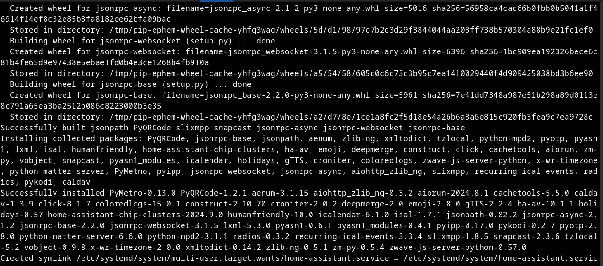

# HASS Core Installer

## About

HASS Core Installer is a streamlined tool for installing, upgrading, and uninstalling Home Assistant Core in a Python virtual environment on Linux systems, including ARM64 devices like the Raspberry Pi 5.

This tool was created in response to the [deprecation of official support for the Home Assistant Core and Supervised installation methods](https://community.home-assistant.io/t/feedback-requested-deprecating-core-supervised-i386-armhf-armv7/880968), as well as the discontinuation of support for certain legacy architectures (i386, armhf, armv7)[4][5]. While Home Assistant OS and Container remain officially supported, many advanced users, developers, and those with unique hardware needs still prefer the flexibility and transparency of Core installations. HASS Core Installer is designed to fill this gap, enabling continued use and development on platforms and in scenarios that official methods no longer support.

HASS Core Installer is actively used at Jambula Labs for rapid deployment and upgrades of Home Assistant Core on custom Linux distributions, such as [Jambula OS Linux](https://github.com/zikusooka/jambula-OS/).

It also supports fully offline installs, upgrades, and uninstalls-provided you have pre-downloaded all required Python package dependencies into the `python/archives` directory.

> Home Assistant is an open-source home automation platform focused on privacy and local control. It serves as a central hub for managing and automating smart home devices, offering integration with a wide range of hardware and services. For more information, visit [home-assistant.io](https://home-assistant.io/).

---

## Why Choose This Installation Type?

**Justification for using this Home Assistant installation type:**

- No longer officially supported, but still viable for advanced users
- Enables offline support, especially for ARM64 platforms
- Allows upgrades between any versions, not limited by official channels
- Provides full control and transparency over the Home Assistant environment
- Lightweight footprint compared to supervised or OS-based methods
- Supports custom Python packages and dependencies
- Integrates seamlessly with system services (e.g., systemd)
- Independence from upstream changes and release cycles
- Ideal for development and custom component testing

---

**Best Use Cases:**

- Developers contributing to Home Assistant or building custom components
- Power users with advanced Linux experience
- Security-focused deployments requiring minimal surface area
- Systems without Docker support (e.g., non-Linux or niche environments)
- Environments where official installation methods are not viable due to hardware or policy constraints

---

## 🧱 System Dependencies


### ▶️ OpenSUSE
sudo zypper install -y \
  python3 python3-pip python3-virtualenv \
  gcc gcc-c++ make \
  libffi-devel libopenssl-devel \
  zlib-devel bzip2-devel readline-devel \
  sqlite3-devel ncurses-devel libxml2-devel \
  libxslt-devel xz-devel bluez-devel \
  systemd-devel glib2-devel \
  avahi-devel avahi-tools uv

### ▶️ Fedora / Redhat

sudo dnf install -y \
  python3 python3-virtualenv python3-pip \
  gcc gcc-c++ make \
  libffi-devel openssl-devel \
  zlib-devel bzip2-devel readline-devel \
  sqlite-devel ncurses-devel libxml2-devel \
  libxslt-devel xz-devel bluez-libs-devel \
  systemd-devel glib2-devel \
  avahi avahi-libs avahi-tools avahi-glib avahi-compat-libdns_sda uv

### ▶️ Debian / Ubuntu

```bash
sudo apt update
sudo apt install -y \
  python3 python3-venv python3-pip \
  build-essential libffi-dev libssl-dev \
  libjpeg-dev zlib1g-dev libbz2-dev libreadline-dev \
  libsqlite3-dev libncursesw5-dev libxml2-dev \
  libxmlsec1-dev libxslt1-dev liblzma-dev \
  bluez libudev-dev avahi-daemon libavahi-client-dev \
  dbus systemd libglib2.0-dev uv

---



---

## Installation

> **Note:** If you are using Jambula OS, this tool is already integrated. Simply run the setup tool included with the OS.

To install on other systems:

1. Open a terminal and navigate to the directory where this tool was cloned.
2. Run:

    ```bash
    sudo ./INSTALL.sh
    ```

3. Wait for the installation to complete.

**Tip:** To use a specific Python version in the virtual environment:

```bash
sudo ./INSTALL.sh "" "" [PYTHON-VERSION]
```

---

## Upgrade

To upgrade Home Assistant Core:

1. Open a terminal and navigate to the directory where this tool was cloned.
2. Run:

    ```bash
    sudo ./INSTALL.sh [NEW-VERSION] [OLD-VERSION]
    ```
    Example:
    ```bash
    sudo ./INSTALL.sh 2025.5.0 2025.4.4
    ```

3. Wait for the upgrade to complete.

**Tip:** To specify a Python version during upgrade:

```bash
sudo ./INSTALL.sh [NEW-VERSION] [OLD-VERSION] [PYTHON-VERSION]
```
Example:
```bash
sudo ./INSTALL.sh 2025.5.0 2025.4.4 3.13.x
```

---

## Configure Home Assistant

After installation or upgrade, configure Home Assistant to connect with your devices and set up automations. Refer to the [official documentation](https://www.home-assistant.io/docs/) for detailed setup instructions.

> **Hint:** Check the `scripts` directory for helper setup tools.

---

## Getting Started

Once installed, access the Home Assistant web interface at `http://localhost:8123` in your browser. Begin configuring your smart home devices and automations.

---

## Support and Community

- For Home Assistant support, visit the [Home Assistant Community Forum](https://community.home-assistant.io/).
- Please consider supporting ongoing development-see the FUNDING file or contact joseph AT zikusooka.com.

---

## TO DO

None

---

Enjoy using HASS Core Installer and remember thank the Home Assistant developers for their outstanding work!
